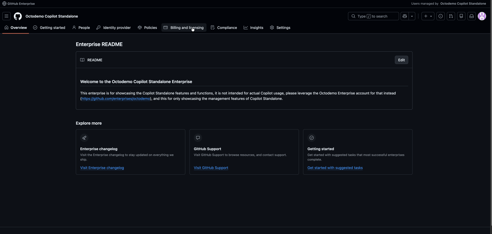

# Managing Copilot usage-based billing

GitHub Copilot now bills based on token consumption through AI Credits (AICs), where 1 credit = $0.01 USD. Every license includes credits (Business: 1,900/month, Enterprise: 3,900/month) that pool across your entire enterprise. When the pool runs out, metered billing kicks in, and budgets control what happens next.

For the full explanation, see [Usage-based billing for organizations and enterprises](https://docs.github.com/en/enterprise-cloud@latest/copilot/concepts/billing/usage-based-billing-for-organizations-and-enterprises).

> [!IMPORTANT]
> Enterprise and Cost Center budgets only cap spending *after* included credits run out. Universal and Individual User Budgets are always active and limit how much of the pool each person can draw, even while the pool still has capacity.

---

## Promotional period (June 1 – September 1, 2026)

For the first three months of usage-based billing, existing customers get more included credits:

| Plan | Standard | Promotional |
|------|----------|-------------|
| Copilot Business | 1,900 AICs/user/month | 3,000 AICs/user/month |
| Copilot Enterprise | 3,900 AICs/user/month | 7,000 AICs/user/month |

### Why this matters for Enterprise seats

During the promo, Enterprise seats include 7,000 AICs vs. 3,000 for Business, a 2.3× difference. If you have developers who will burn through 3,000 credits/month, putting them on Enterprise seats during this window gets you more pooled credits at no extra per-credit cost.

> [!NOTE]
> Copilot Enterprise requires a GitHub Enterprise Cloud (GHEC) seat. This only works for users who already have GHEC. If they don't, you'd also need to purchase a GHEC seat, so factor that cost in before upgrading.

After September 2026 the advantage disappears. Both tiers include credits proportional to their license cost ($0.01/AIC), so upgrading from Business to Enterprise adds $20/month in cost alongside $20 in credit value. No net gain. At that point, raising Individual User Budgets is cheaper than upgrading tiers (see Tip #5).

> [!TIP]
> Use the promotional window to find your power users and get them on Enterprise seats. After the promo ends, switch to Individual User Budgets for anyone who needs more headroom.

---

## The four budget controls

There are four budget levels, and they don't all work the same way:

### Enterprise Budget *(post-pool only)*

A hard ceiling on metered charges after the shared pool runs dry. Does nothing while the pool still has capacity. This is not a total budget for your Copilot spend; it only governs overage.

### Cost Center Budget *(overage only)*

Caps metered charges for a GitHub org or group of users *after the enterprise entitlement pool is fully exhausted*. While the pool still has capacity, Cost Center budget progress stays at $0 — it only begins tracking once overage (metered billing) kicks in. Useful for departmental chargeback on overage spend.

> [!WARNING]
> A Cost Center budget cannot unblock a user who has hit their Universal or Individual User Budget. If the pool still has capacity and a user is blocked, the constraint is their personal budget — raise the Universal User Budget or grant an Individual User Budget instead.

### Universal User Budget *(always active)*

Caps how much of the shared pool any single person can draw per month. This is the one you care about most. Without it, one user or one automated agent can drain the entire pool overnight.

### Individual User Budget *(always active)*

A higher personal cap for named users who need more than the universal limit.

---

## Recommended budget strategy

The approach that works best for most organizations is progressive: start generous, then use the limits to discover who your heavy users are and what they're working on.

### Step 1: Set the Universal User Budget at 2.5–3× entitled credits

Give every user a Universal User Budget (ULB) of 2.5–3× their per-seat entitlement:

- Business users (1,900 AICs included): set ULB to 4,750–5,700 AICs
- Enterprise users (3,900 AICs included): set ULB to 9,750–11,700 AICs

This lets heavier users borrow from lighter users' unused portions without anyone monopolizing the pool. If credits are left over at month end, raise it. You want near-zero remaining credits with nobody blocked mid-month.

> [!TIP]
> Capping at exactly 1× the per-license value defeats the purpose of pooling. Heavy users get blocked while light users waste credits. 2.5–3× is the sweet spot.

### Step 2: When someone hits the limit, find out why

When a developer hits their Universal User Budget, don't just raise it. Instead:

1. Grant them an Individual User Budget with a higher cap. This is the only way to give a specific user more headroom within the pool — Cost Center budgets won't help here since they only track overage after the pool is exhausted.
2. Find out what project they're working on. This context is how you build the case for AI investment.

### Step 3: Build your champions program

The developers who consistently hit their budgets are your power users. They're also the foundation of a good AI adoption story:

- Identify them through budget notifications and usage data
- Collect their stories: what they're shipping faster, what problems Copilot is solving for them
- Use those stories to demonstrate business value and justify continued investment

> [!NOTE]
> This turns cost management into a discovery exercise. Budget notifications become a signal for where AI is delivering real returns, not just a spending alert.

---

## Configuration tips

### 1. Always set a Universal User Budget

> [!WARNING]
> Without a Universal User Budget, one user or one automated agent can consume the entire pool overnight. Set this before anything else.

Here's how to set it in the enterprise billing settings:

### 2. Always enable "Stop usage" on budgets

Without the "Stop usage" option enabled, every budget is advisory only. It sends a notification when the threshold is crossed, but usage and billing keep going. Enable it on every budget if you want actual cost ceilings.

### 3. Size the Enterprise Budget from your seat mix

The Enterprise Budget is a post-pool safety net. Calculate it as: total max consumption minus pool value = potential additional spend. Add a buffer. It does nothing while the pool still has capacity.

### 4. Budgets only track from their creation date

When you first create a budget, it applies only to metered usage from that date forward. Prior consumption isn't counted. This means you can exceed your budget in the first cycle even with "Stop usage" enabled. Create or adjust budgets at the start of a billing cycle whenever possible. If creating mid-cycle, set the limit conservatively. See [Budgets and alerts](https://docs.github.com/en/enterprise-cloud@latest/billing/concepts/budgets-and-alerts#your-first-billing-cycle-after-creating-a-budget) for details.

### 5. Raise Individual User Budgets before upgrading tiers *(post-promotional period)*

After September 2026, an Individual User Budget on a Business license lets a user borrow more from the pool at no extra cost. Upgrading from Business to Enterprise adds $20/month in licensing alongside $20 in credit value. No net gain. If someone needs more capacity post-promo, raise their Individual User Budget first.

> [!NOTE]
> During the promotional period (June 1 – September 1, 2026), Enterprise seats include disproportionately more AICs (7,000 vs. 3,000), so the upgrade is worthwhile for power users who already have a GHEC seat. See the [Promotional period](#promotional-period-june-1--september-1-2026) section.

### 6. Gate budget increases on prior-month usage data

Individual User Budgets don't expand the pool. They raise the per-user ceiling, which accelerates depletion for everyone. Require usage data before granting increases: if someone didn't hit their limit last month, they don't need a higher one.

### 7. Share pool depletion metrics monthly

Publish a simple end-of-month summary ("Pool was 74% consumed, no one was blocked"). When people can see the pool is healthy, they're less likely to inflate usage defensively or rush to consume credits early in the cycle.

---

## Cost center exclusion

One toggle changes how Enterprise and Cost Center Budgets interact. Decide on this before sizing any budgets because it changes the math for everything.

> [!IMPORTANT]
> Regardless of exclusion setting, Cost Center budgets never override Universal or Individual User Budgets. A user capped by their personal budget cannot be unblocked by any Cost Center budget configuration. Cost Center budgets only govern overage spend after the pool is exhausted.

### Exclusion OFF (default)

The Enterprise Budget covers all metered charges beyond the pool, including those attributed to cost centers. Cost center budgets act as sub-limits within it.

Most organizations should use this. One cap, simpler to reason about.

### Exclusion ON

Enterprise and cost center budgets become independent meters. Charges attributed to a cost center don't count against the enterprise budget at all.

Use this when departments manage their own AI spend and need full autonomy. But every cost center must have its own budget configured.

> [!WARNING]
> Never enable exclusion without configuring cost center budgets for every team. Any cost center without a budget has no metered charge ceiling at all.

---

## When developers are blocked

When someone reports being blocked, work through these checks in order:

1. **Did they hit their Universal or Individual User Budget?**
   - Yes: raise their budget or grant an Individual User Budget with a higher cap. This is the cause nine times out of ten.
   - No: keep checking.

2. **Is the shared pool depleted?**
   - No: the pool still has capacity. The issue is the user's personal budget (step 1) or their license/feature access. Cost Center budgets are irrelevant here — they only track overage after the pool is exhausted.
   - Yes: keep checking.

3. **Has the Enterprise Budget been reached?**
   - Yes: raise it. It's capping total metered charges.

4. **Are they in a cost center with a budget that has "Stop usage" enabled?**
   - Yes and the pool is depleted: the cost center budget is capping their overage. Raise it or remove the cap.
   - No: check whether "Stop usage" is enabled on the Enterprise Budget, or whether their license was removed.

> [!TIP]
> Mid-month blocks are almost always the Universal User Budget. Cost Center budgets only matter after the pool runs out — they cannot unblock a user who hit their personal cap while pooled credits remain.

> [!NOTE]
> A common misconception is that placing a user in a Cost Center with a higher budget will let them exceed their Universal User Budget. It won't. Cost Center budgets track overage spend, not pooled entitlement usage. The only way to give a user more headroom within the pool is to raise their Universal User Budget or assign an Individual User Budget.

---

## Budget management via API

You can manage budgets programmatically through the [Budget Management API](https://docs.github.com/en/rest/billing/budgets): create, update, delete budgets, adjust alert thresholds, and automate provisioning as part of team onboarding.

The [Usage Summary API](https://docs.github.com/en/rest/billing/usage) lets you pull usage data filtered by org, repo, cost center, product, or SKU.

---

*Budget guidance adapted from [xrvk](https://github.com/xrvk)*
